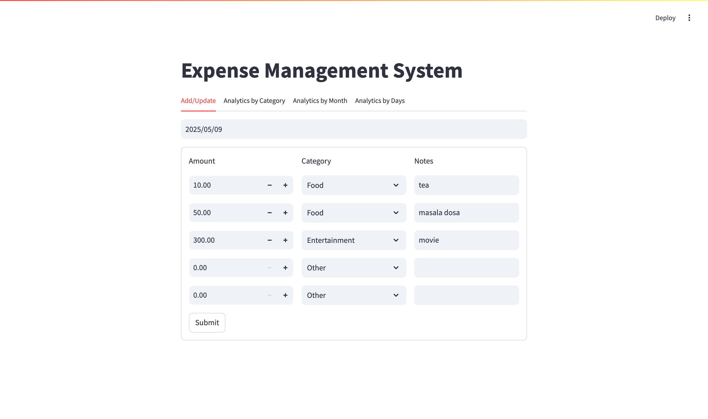
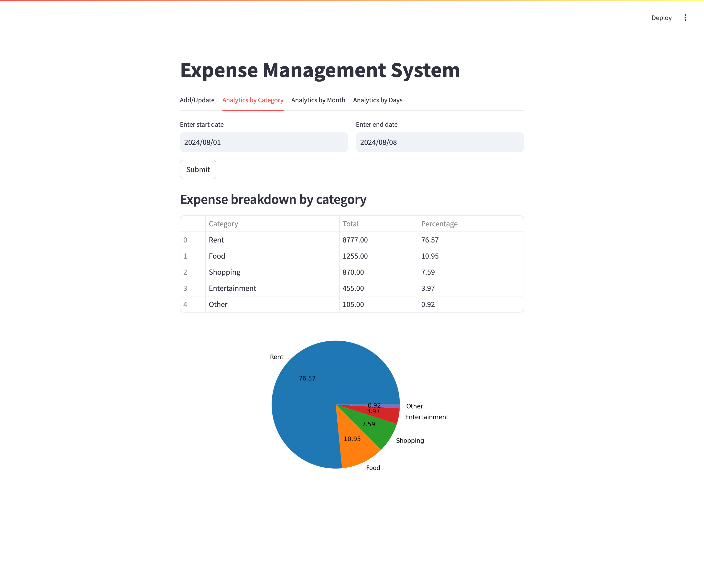
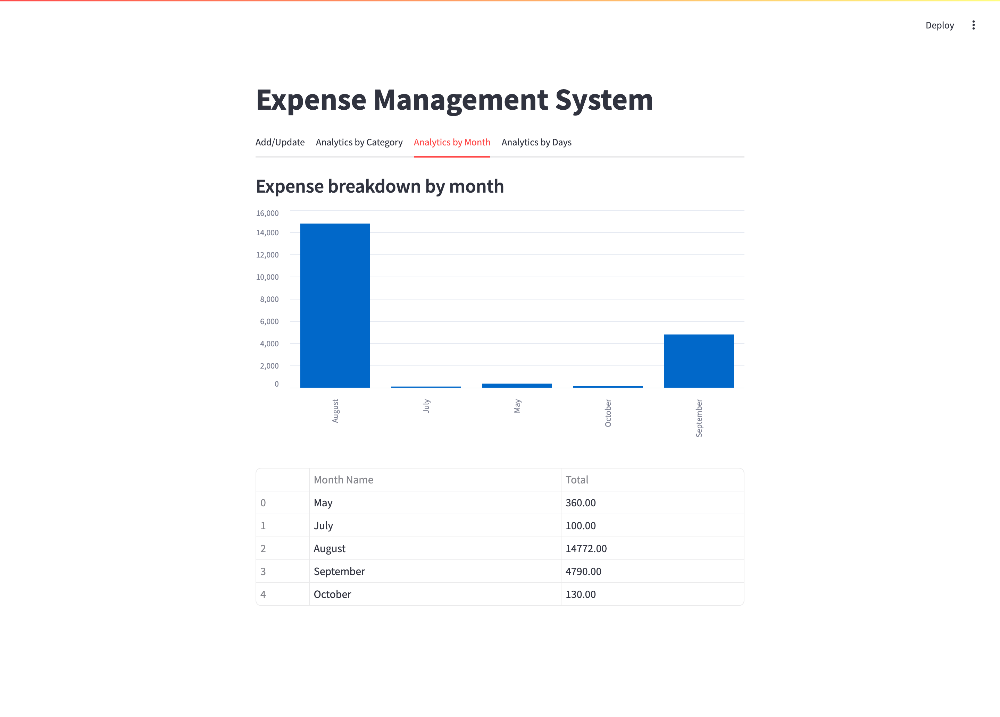
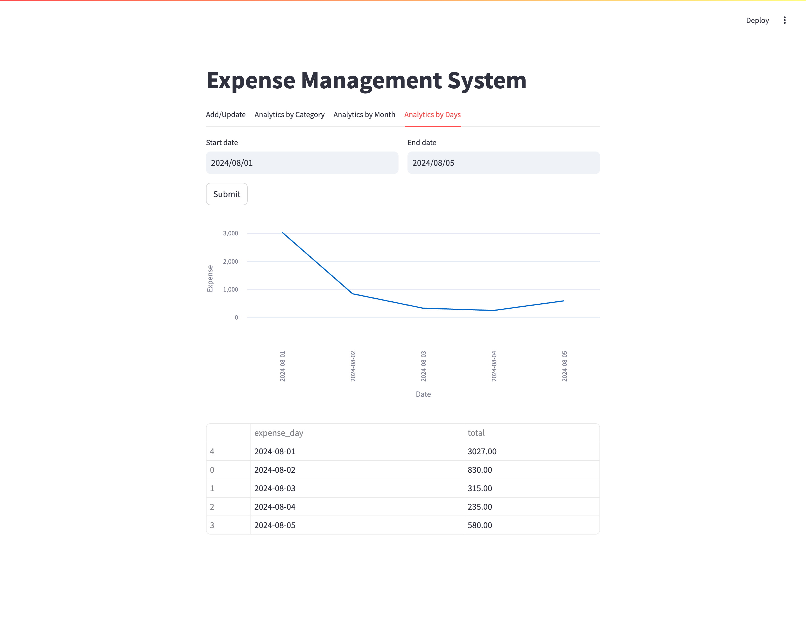

# Expense Management System

The **Expense Management System** is a full-stack web application that helps users efficiently track and analyze their daily spending. It allows users to add, update, and view expenses and offers **three powerful dashboards** for financial insights:

- 📊 **Category-wise Analysis** across a selected date range  
- 📆 **Monthly Expense Trends** to monitor long-term patterns  
- 📅 **Daily Expense Summary** for a day-by-day breakdown (new)

## Tech Stack:

- **Frontend**: [Streamlit](https://streamlit.io/) for a clean, interactive user experience  
- **Backend**: [FastAPI](https://fastapi.tiangolo.com/) for fast, scalable API handling  
- **Database**: MySQL for structured expense data storage

---

## Project Structure

- **frontend/**: Contains the Streamlit application code.
- **backend/**: Contains the FastAPI backend server code.
- **requirements.txt**: Lists the required Python packages.
- **README.md**: Provides an overview and instructions for the project.

## Setup Instructions

1. **Clone the repository**:
   ```bash
   git clone https://github.com/yourusername/expense-management-system.git
   cd expense-management-system
   ```
1. **Create and activate virtual environment:**:   
   ```bash
    python -m venv venv  # Create virtual environment
    source venv/bin/activate  # For macOS/Linux
    venv\Scripts\activate  # For Windows
   ```
1. **Install dependencies:**:   
   ```commandline
    pip install -r requirements.txt
   ```
1. **Run the FastAPI server:**:   
   ```commandline
    fastapi dev backend/server.py
   ```
1. **Run the Streamlit app:**:   
   ```commandline
    streamlit run frontend/app.py
   ```

## API Endpoints (FastAPI)

| Method | Endpoint         | Description                              | Request Body Parameters                                                                                    |
| :----- | :--------------- | :--------------------------------------- | :--------------------------------------------------------------------------------------------------------- |
| **GET**  | `/expenses/{date}` | Retrieve all expenses on a specific date | *None*                                                                                                 |
| **POST** | `/expenses/{date}` | Add a new expense on a specific date    | An array of objects, each with: `category`: String, `amount`: Float, `notes`: String                  |
| **POST** | `/category_summary`      | Fetch expenses between two dates grouped by category         | `start_date`: Date (YYYY-MM-DD), `end_date`: Date (YYYY-MM-DD)                                          |
| **GET**  | `/monthly_summary`      | Get all the expenses grouped by month   | *None*                                                                                                 |
| **POST**  | `/daily_summary`      | Get all the expenses between two days   | `start_date`: Date (YYYY-MM-DD), `end_date`: Date (YYYY-MM-DD)

**Note:** For POST requests, the request body should be sent as a JSON object.


## App Screenshots

### 1. Home Page – Add & View Expenses


### 2. Category-wise Analytics


### 3. Monthly Trends


### 4. Daily Summary

